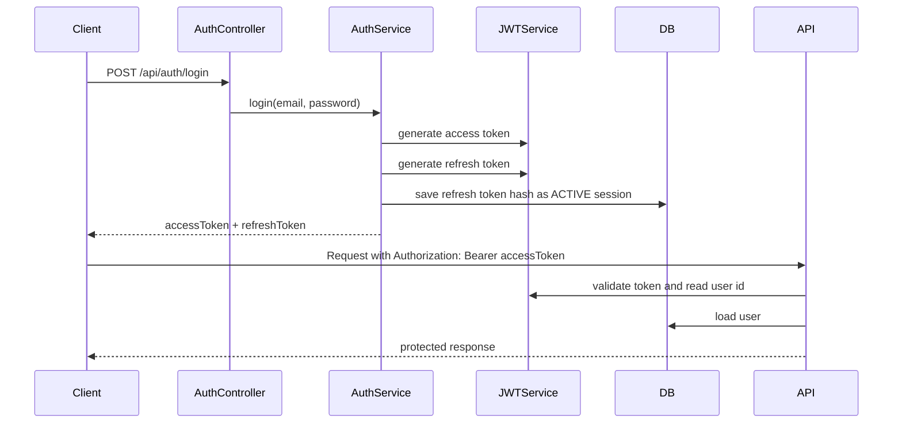

# Module 6: Advanced Spring Security

This module is about building a more realistic Spring Security system with JWT, refresh tokens, OAuth2 login, session tracking, roles, authorities, and method-level authorization.

The main idea is simple:

```text
Authentication = Who are you?
Authorization  = What are you allowed to do?
```

Spring Security solves both, but it solves them in layers. This README explains those layers in an easy order.

## What This Module Covers

- Access tokens and refresh tokens
- JWT authentication
- Server-side refresh-token sessions
- Login, refresh, logout, and logout-all
- OAuth2 login with Google
- Roles vs authorities
- Request matchers vs method security
- `@PreAuthorize`, `@PostAuthorize`, `@Secured`, and `@RolesAllowed`
- Subscription-based authorization
- Common mistakes and interview questions

## Folder Structure

```text
MODULE6
|-- 6.1 JWT/RefreshTokenAndAccessToken
|   `-- Introduces access tokens and refresh tokens
|-- 6.2 GoogleAuth2ClientAuthentication
|   `-- Adds Google OAuth2 login
|-- 6.3 UserSessionManagmentWithJWT
|   `-- Tracks refresh-token sessions in the database
|-- 6.4 RoleBasedAuthorization
|   `-- Adds role-based access rules
|-- 6.5 GranularAuthorization
|   `-- Adds fine-grained permissions/authorities
|-- 6.6 SecurityMethodsAnnotations
|   `-- Adds method-level security annotations
|-- notes
|   `-- Word notes for JWT, OAuth2, roles, authorities, and method security
`-- projects
    |-- DynamicSessionLimitCount
    |-- logoutJWT
    |-- singleActiveRefreshSessionPerUser
    `-- subscription-service
```

The best final project to study is:

```text
projects/subscription-service
```

That project combines JWT, refresh-token sessions, OAuth2 login, logout, method security, and subscription-plan authorization.

## Big Picture

Security happens in two major places:

```text
Client
  |
  v
Spring Security Filter Chain
  |
  v
Controller
  |
  v
Service / Business Logic
```

The filter chain handles authentication first. Then request matchers and method security handle authorization.

## Authentication vs Authorization

### Authentication

Authentication answers:

```text
Who is this user?
```

Examples:

- User logs in with email and password
- User logs in with Google OAuth2
- JWT is verified from the `Authorization` header

### Authorization

Authorization answers:

```text
What can this user access?
```

Examples:

- Only logged-in users can access protected APIs
- Only users with a certain role can access admin APIs
- Only premium subscribers can access premium features

## Core Spring Security Setup

In the final `subscription-service`, security is configured in:

```text
projects/subscription-service/src/main/java/com/umair/subscription/config/SecurityConfig.java
```

Important annotations:

```java
@EnableWebSecurity
@EnableMethodSecurity(securedEnabled = true)
```

`@EnableWebSecurity` enables web security.

`@EnableMethodSecurity` turns on method-level security annotations like:

- `@PreAuthorize`
- `@PostAuthorize`
- `@Secured`
- `@RolesAllowed`

Without `@EnableMethodSecurity`, those annotations are just decoration. They do not protect anything.

## Security Filter Chain

The final project uses this pattern:

```java
return http
    .csrf(csrf -> csrf.disable())
    .sessionManagement(sm -> sm.sessionCreationPolicy(SessionCreationPolicy.STATELESS))
    .authorizeHttpRequests(auth -> auth
        .requestMatchers(
            "/signup",
            "/api/auth/login",
            "/api/auth/refresh",
            "/api/auth/logout",
            "/oauth2/**",
            "/home.html"
        ).permitAll()
        .anyRequest().authenticated()
    )
    .addFilterBefore(jwtAuthenticationFilter, UsernamePasswordAuthenticationFilter.class)
    .formLogin(form -> form.disable())
    .httpBasic(basic -> basic.disable())
    .oauth2Login(oauth -> oauth.successHandler(oAuth2SuccessHandler))
    .build();
```

Meaning:

- CSRF is disabled because this is mainly an API-style backend
- Server sessions are not used for normal API authentication
- Some auth endpoints are public
- Everything else requires authentication
- The custom JWT filter runs before Spring's username/password filter
- OAuth2 login uses a custom success handler

Code note:

The controller has signup at:

```text
POST /api/auth/signup
```

But the current permit list contains:

```text
/signup
```

If signup should be public, add `/api/auth/signup` to `permitAll()`.

## JWT Flow

JWT means JSON Web Token. It is a signed token that carries user identity information.

In this module:

- Access token is short-lived
- Refresh token is long-lived
- Access token is used for API requests
- Refresh token is used only to get a new access token

## Access Token vs Refresh Token

| Feature | Access Token | Refresh Token |
|---|---|---|
| Purpose | Access protected APIs | Get a new access token |
| Lifetime | Short | Long |
| Sent with every API request | Yes | No |
| Stored in database | Usually no | Yes, or hash of it |
| Revocable | Harder | Easy |
| Damage if stolen | Limited window | High risk |

Recommended lifetime:

- Access token: 5 to 15 minutes
- Refresh token: days or weeks, depending on the app

## JWT Login Flow

Email/password login starts here:

```text
POST /api/auth/login
```

Flow:

```text
1. Client sends email and password
2. AuthController calls AuthService.login()
3. AuthenticationManager verifies credentials
4. Spring loads the user and checks the password
5. JWTService creates an access token
6. JWTService creates a refresh token
7. Server stores SHA-256 hash of refresh token in sessions table
8. Response returns access token and refresh token
```

In code:

```java
String accessToken = jwtService.generateAccessToken(user);
String refreshToken = jwtService.generateRefreshToken(user);

session.setRefreshTokenHash(RefreshTokenHasher.sha256(refreshToken));
session.setStatus(SessionStatus.ACTIVE);
session.setExpiresAt(LocalDateTime.now().plusDays(30));
```

The raw refresh token is returned to the client, but the database stores only its hash.

That is much safer than storing the raw token.

## JWT Request Flow

After login, the client calls protected endpoints like this:

```http
Authorization: Bearer <access-token>
```

Flow:

```text
1. Request enters Spring Security
2. JwtAuthenticationFilter checks the Authorization header
3. If there is no Bearer token, the request continues unauthenticated
4. If token exists, JWTService verifies it
5. User id is read from the token subject
6. User is loaded from the database
7. UsernamePasswordAuthenticationToken is created
8. User authorities are added
9. Authentication is stored in SecurityContext
10. Controller and method security can now use the authenticated user
```

The filter is:

```text
projects/subscription-service/src/main/java/com/umair/subscription/filters/JwtAuthenticationFilter.java
```

Key line:

```java
SecurityContextHolder.getContext().setAuthentication(authentication);
```

That line is what makes Spring treat the request as authenticated.

## Visual JWT Flow



## Refresh Token Flow

Refresh starts here:

```text
POST /api/auth/refresh
```

Flow:

```text
1. Client sends refresh token
2. Server hashes the raw refresh token
3. Server searches for an ACTIVE session with that hash
4. If no session exists, reject the request
5. If session is expired, mark it REVOKED and reject
6. If valid, create new access token
7. Create new refresh token
8. Replace old refresh-token hash with new hash
9. Return new tokens
```

This is refresh-token rotation.

Why rotation matters:

- Every refresh call invalidates the previous refresh token
- If an old refresh token is reused, that is suspicious
- Rotation reduces damage if a refresh token leaks

## Logout Flow

Logout starts here:

```text
POST /api/auth/logout
```

Flow:

```text
1. Client sends refresh token
2. Server hashes it
3. Server finds matching ACTIVE session
4. Server changes status to REVOKED
5. Refresh token can no longer mint access tokens
```

Logout all devices:

```text
POST /api/auth/logout-all
```

This revokes all active sessions for the authenticated user.

## Why Store Refresh Token Hashes?

Refresh tokens are powerful. If someone steals one, they can keep generating new access tokens.

So the safer design is:

```text
Client stores raw refresh token
Database stores SHA-256 hash of refresh token
```

When a refresh request comes in:

```text
hash(incoming refresh token) == stored hash
```

This is similar to password storage thinking: do not store the raw secret when you can store a hash.

## OAuth2 Login Flow

OAuth2 is used for login with providers like Google.

Important mental model:

```text
Google tokens are for Google.
Your app's JWT is for your API.
```

OAuth2 proves the user's identity through Google. After success, your backend creates its own local user and issues your own JWT tokens.

## OAuth2 Authorization Code Flow

Flow:

```text
1. User clicks "Login with Google"
2. Browser goes to /oauth2/authorization/google
3. Spring redirects browser to Google
4. User logs in with Google
5. Google redirects back to /login/oauth2/code/google with code and state
6. Spring validates state
7. Backend exchanges code for Google tokens
8. Spring authenticates the Google user
9. OAuth2SuccessHandler finds or creates local user
10. Backend issues its own access token and refresh token
11. Backend stores refresh-token hash as a session
12. User is redirected to home page with token
```

In the final project:

```text
projects/subscription-service/src/main/java/com/umair/subscription/handler/OAuth2SuccessHandler.java
```

Important steps:

```java
String email = oAuth2User.getAttribute("email");
String name = oAuth2User.getAttribute("name");
```

Then:

```java
String accessToken = jwtService.generateAccessToken(user);
String refreshToken = jwtService.generateRefreshToken(user);
```

Then:

```java
session.setRefreshTokenHash(RefreshTokenHasher.sha256(refreshToken));
```

## OAuth2 vs JWT

| Topic | OAuth2 | JWT |
|---|---|---|
| Main purpose | Delegated login/authorization | Token format for API auth |
| Who issues it here? | Google | Your backend |
| Used for your API? | Not directly | Yes |
| Stores password? | No | No |
| Common flow | Authorization Code Flow | Bearer token flow |

Interview line:

OAuth2 lets the user log in through a trusted provider. JWT is what your backend issues so the frontend can call your APIs.

## OAuth2 State Parameter

The `state` parameter protects against CSRF attacks in OAuth2.

Spring creates a random state value before redirecting to Google. When Google redirects back, Spring checks that the returned state matches.

If state does not match, the login is rejected.

Important note:

OAuth2 login often needs temporary server-side storage for the authorization request and state. A fully `STATELESS` setup can cause OAuth2 redirect loops if state cannot be stored correctly.

## Roles vs Authorities

This is one of the most important Spring Security topics.

Spring Security checks authorities.

A role is just an authority with the `ROLE_` prefix.

Example:

```text
hasRole("ADMIN")
```

Spring checks:

```text
ROLE_ADMIN
```

So these are equivalent:

```java
hasRole("ADMIN")
hasAuthority("ROLE_ADMIN")
```

But this is different:

```java
hasAuthority("ADMIN")
```

That checks for exactly `ADMIN`, not `ROLE_ADMIN`.

## Roles vs Permissions

In `6.5 GranularAuthorization`, roles and permissions are separated.

Roles:

```java
USER,
ADMIN,
CREATOR
```

Permissions:

```java
POST_VIEW,
POST_CREATE,
POST_DELETE,
POST_UPDATE,
USER_VIEW,
USER_CREATE,
USER_DELETE,
USER_UPDATE
```

Mapping:

```java
USER    -> USER_VIEW, POST_VIEW
CREATOR -> POST_CREATE, USER_UPDATE, POST_UPDATE
ADMIN   -> USER_DELETE, USER_CREATE, POST_DELETE, POST_CREATE, USER_UPDATE, POST_UPDATE
```

This is better than checking only roles because permissions are more specific.

## Request Matchers vs Method Security

Think of your app like a building.

Request matchers are security at the front door.

Method security is security inside the rooms.

### Request Matchers

Defined in `SecurityFilterChain`.

Example:

```java
.requestMatchers("/api/auth/login").permitAll()
.anyRequest().authenticated()
```

They answer:

```text
Can this request reach the controller?
```

### Method Security

Defined on controller or service methods.

Example:

```java
@PreAuthorize("@subAuth.hasPlan(authentication, T(com.umair.subscription.entities.enums.PlanType).PREMIUM)")
```

They answer:

```text
Can this authenticated user run this method?
```

## Method Security Annotations

| Annotation | Runs | Best for |
|---|---|---|
| `@PreAuthorize` | Before method | Most common checks |
| `@PostAuthorize` | After method | Checks based on return value |
| `@Secured` | Before method | Simple role checks |
| `@RolesAllowed` | Before method | JSR-250 role checks |

Most common choice:

```java
@PreAuthorize("hasAuthority('POST_DELETE')")
```

Or with custom logic:

```java
@PreAuthorize("@subAuth.hasAtLeast(authentication, T(com.umair.subscription.entities.enums.PlanType).BASIC)")
```

## Subscription Authorization

The final project has subscription plans:

```java
FREE,
BASIC,
PREMIUM
```

The helper class is:

```text
projects/subscription-service/src/main/java/com/umair/subscription/utils/SubscriptionAuthorization.java
```

It has two important methods:

```java
hasAtLeast(authentication, PlanType.BASIC)
hasPlan(authentication, PlanType.PREMIUM)
```

Used in:

```text
projects/subscription-service/src/main/java/com/umair/subscription/controllers/SubscriptionController.java
```

Examples:

```java
@PreAuthorize("@subAuth.hasAtLeast(authentication, T(com.umair.subscription.entities.enums.PlanType).BASIC)")
@GetMapping("/basic-feature")
```

This allows `BASIC` and `PREMIUM`.

```java
@PreAuthorize("@subAuth.hasPlan(authentication, T(com.umair.subscription.entities.enums.PlanType).PREMIUM)")
@GetMapping("/premium-feature")
```

This allows only `PREMIUM`.

## Important Endpoints

### Auth Endpoints

| Method | Endpoint | Purpose | Public? |
|---|---|---|---|
| `POST` | `/api/auth/signup` | Create user | Should be public |
| `POST` | `/api/auth/login` | Login with email/password | Yes |
| `POST` | `/api/auth/refresh` | Get new access/refresh token | Yes |
| `POST` | `/api/auth/logout` | Revoke one refresh-token session | Yes |
| `POST` | `/api/auth/logout-all` | Revoke all sessions for current user | No |

### Subscription Endpoints

| Method | Endpoint | Purpose |
|---|---|---|
| `GET` | `/api/subscriptions/effective-plan?userId=1` | Check current effective plan |
| `POST` | `/api/subscriptions/upgrade` | Upgrade subscription |
| `GET` | `/api/subscriptions/basic-feature` | Requires at least BASIC |
| `GET` | `/api/subscriptions/premium-feature` | Requires PREMIUM |

## How a Protected Request Works End to End

```text
1. Client sends request with Authorization: Bearer <access-token>
2. JwtAuthenticationFilter extracts token
3. JWTService validates signature and expiry
4. User id is read from token subject
5. User is loaded from database
6. Authentication object is created with authorities
7. SecurityContext is populated
8. Request matcher checks URL-level rule
9. Controller method is reached
10. @PreAuthorize checks method-level rule
11. Method runs or returns 403
```

## Common Mistakes

- Forgetting `@EnableMethodSecurity`
- Confusing roles with authorities
- Using `hasAuthority("ADMIN")` when your authority is actually `ROLE_ADMIN`
- Storing refresh tokens as raw strings in the database
- Making access tokens too long-lived
- Using refresh tokens to call APIs
- Expecting `@RestControllerAdvice` to catch every security exception
- Forgetting that filter-level errors may need `AuthenticationEntryPoint` or `AccessDeniedHandler`
- Breaking OAuth2 login by forcing a fully stateless flow with no place to store `state`
- Using Google access tokens directly as your app's API tokens
- Forgetting to rotate refresh tokens
- Forgetting to revoke refresh tokens on logout
- Not permitting the real signup endpoint

## Run the Final Project

Go to:

```powershell
cd D:\SoftwareEngineering\Backend\AdvancedSpringSecurity\MODULE6\projects\subscription-service
```

Run:

```powershell
.\mvnw.cmd spring-boot:run
```

Run tests:

```powershell
.\mvnw.cmd test
```

## Study Order

Use this order:

```text
1. Read access token vs refresh token
2. Understand JwtAuthenticationFilter
3. Understand JWTService
4. Understand AuthService.login()
5. Understand AuthService.refresh()
6. Understand sessions table
7. Understand logout and logout-all
8. Learn roles vs authorities
9. Learn request matchers vs method security
10. Learn OAuth2 login flow
```

## 20 Best Frequently Asked Questions

### 1. What is the difference between authentication and authorization?

Authentication checks who the user is. Authorization checks what the user is allowed to access.

### 2. What is JWT used for?

JWT is used to carry signed user identity information between client and server. In this module, the access token is a JWT used to authenticate API requests.

### 3. What is the difference between access token and refresh token?

An access token is short-lived and sent with API requests. A refresh token is long-lived and used only to get a new access token.

### 4. Why should access tokens be short-lived?

If an access token is stolen, the attacker can use it until it expires. A short lifetime reduces the damage window.

### 5. Why store refresh tokens in the database?

Because refresh tokens need to be revocable. If they are stored server-side, the backend can revoke them on logout, suspicious activity, or password changes.

### 6. Why store the hash of a refresh token instead of the raw token?

If the database leaks, raw refresh tokens would let attackers mint new access tokens. A hash is safer because the server can verify incoming tokens without storing the raw secret.

### 7. What is refresh-token rotation?

Refresh-token rotation means every refresh request returns a new refresh token and invalidates the old one. This helps detect and reduce token theft.

### 8. What does `JwtAuthenticationFilter` do?

It reads the `Authorization: Bearer` header, validates the JWT, loads the user, creates an `Authentication` object, and stores it in `SecurityContext`.

### 9. What is `SecurityContext`?

`SecurityContext` stores the current authenticated user for the request. Authorization rules read from it to decide whether the user is allowed.

### 10. What does `SessionCreationPolicy.STATELESS` mean?

It means Spring Security should not use server-side HTTP sessions for normal API authentication. Each request must authenticate itself, usually with a token.

### 11. If JWT is stateless, why do we still have a sessions table?

Access-token authentication is stateless, but refresh-token management is stateful. The sessions table lets the backend revoke refresh tokens, track devices, and support logout.

### 12. What is OAuth2?

OAuth2 is a protocol that lets an app get limited access through another provider, such as Google, without seeing the user's password.

### 13. What is OpenID Connect?

OpenID Connect is an identity layer on top of OAuth2. It adds login identity information, usually through an ID token.

### 14. Why should we issue our own JWT after Google login?

Google tokens are meant for Google APIs. Your backend should issue its own JWT so your application controls token lifetime, claims, permissions, and logout behavior.

### 15. What is the OAuth2 authorization code flow?

The browser is redirected to Google, the user logs in, Google redirects back with a temporary code, and the backend exchanges that code for tokens.

### 16. What is the `state` parameter in OAuth2?

`state` is a random value used to protect the OAuth2 flow from CSRF attacks. The value sent to Google must match the value returned by Google.

### 17. What is the difference between role and authority?

Spring checks authorities. A role is just an authority with the `ROLE_` prefix. `hasRole("ADMIN")` checks for `ROLE_ADMIN`.

### 18. When should you use request matchers?

Use request matchers for broad URL-level rules, such as public endpoints, authenticated endpoints, and admin-only endpoint groups.

### 19. When should you use method security?

Use method security for business rules, ownership checks, subscription-plan checks, and permission checks that are too specific for URL rules.

### 20. What is the best mental model for Spring Security?

Filters authenticate the user. Authorities describe what the user can do. Request matchers protect URLs. Method security protects business actions.

## Quick Interview Summary

Say this:

```text
In this module, authentication is handled with JWT access tokens and OAuth2 login. Access tokens are short-lived and used for API calls. Refresh tokens are long-lived, stored as hashes in the database, rotated during refresh, and revoked during logout. Spring Security authenticates requests through a custom JWT filter, stores the user in SecurityContext, then applies URL-level rules through request matchers and method-level rules through annotations like @PreAuthorize.
```

That answer covers the whole architecture cleanly.
